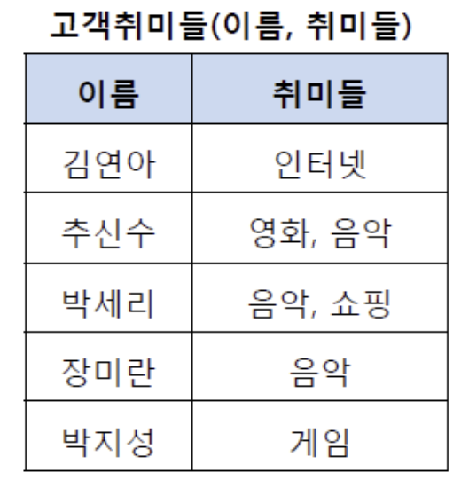
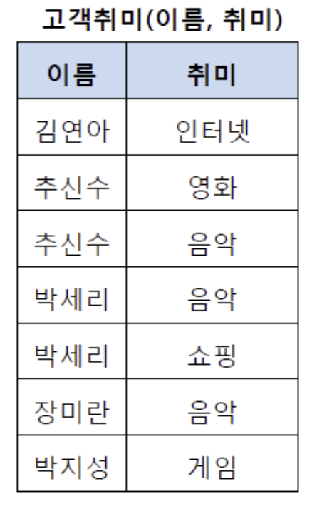
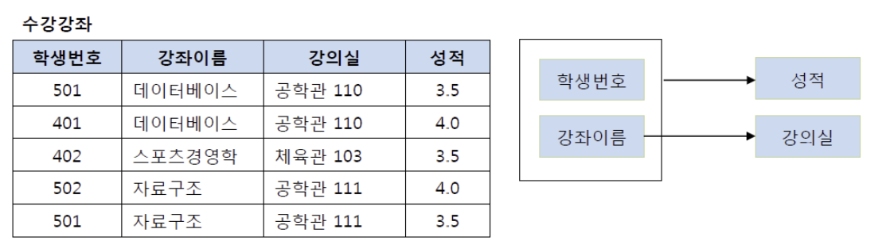
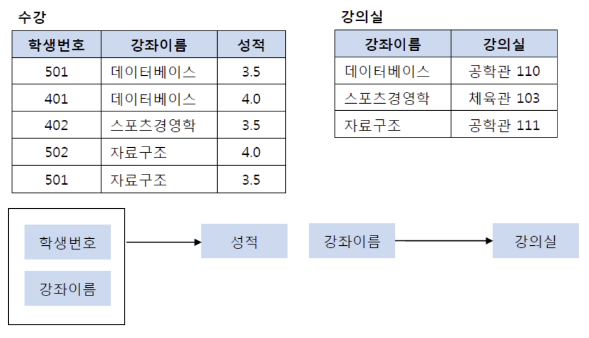
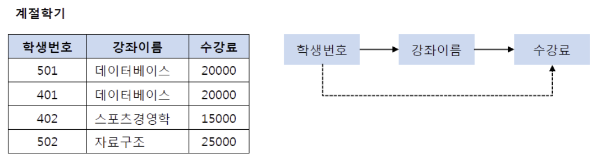
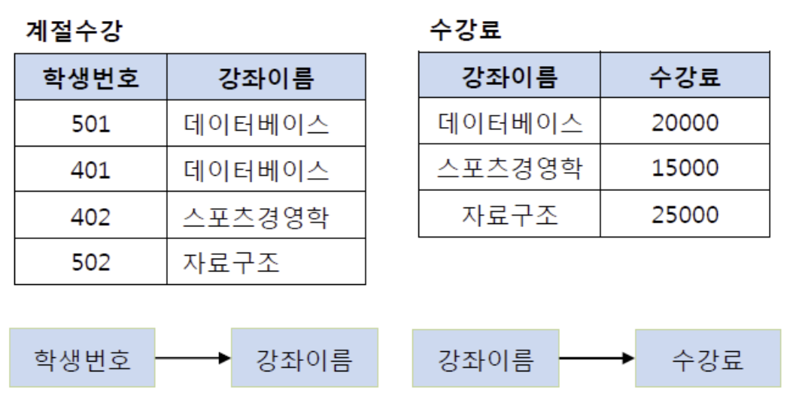
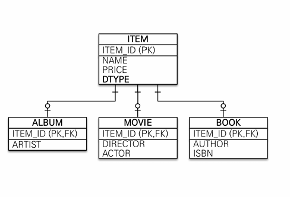
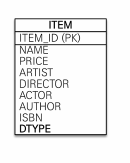
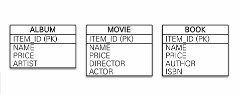

- PK, FK란?
    
    ### **PK(Primary Key, 기본키)**
    
    테이블에 저장된 레코드를 고유하게 식별하기 위해 사용되는 속성
    
    중복되지 않는 고유한 식별자
    
    - `UNIQUE(중복 불가)`
    - `NOT NULL(NULL 금지)`
    - `불변성`
    
    변경 가능성이 있는 데이터를 PK로 설정해선 안 된다.
    ex) 주민등록번호를 PK로 사용하다가 저장 금지로, 변경 cost 발생
    
    <aside>
    💡
    
    <비즈니스와 관련 없는 키>를 사용하는 걸 권장한다.
    **권장**: Long형 + 대체키 + 키 생성전략 사용 
    
    </aside>
    
    ---
    
    ### **FK(Foreign Key, 외래키)**
    
    한 테이블의 키 중에서 다른 테이블의 레코드를 식별할 수 있는 키
    
    - `무결성 보장`
    - `테이블 간 관계 표현`
    - `데이터 중복 제거`
    
- ERD란?
    
    ### **ERD: Entity Relationship Diagram**
    
    데이터베이스 구조를 시각적으로 나타내는 다이어그램
    → “테이블 구조를 한 눈에 보고 이해하기 쉽도록” 하기 위함이다
    
    ---
    
    ERD에는 다음과 같은 요소가 들어간다
    
    1. 각 테이블간의 관계
    2. 각 테이블에 들어가는 속성
    3. 속성별 제약조건
    4. 속성별 주석 (선택)
    
- 연관관계란? 그리고 연관관계를 설정하는 방법은?
    
    ### **연관관계**
    
    두 개 이상의 테이블 간에 존재하는 관계
    
    ---
    
    **종류**
    
    일대일 (1 to 1), 일대다(1 to N), 다대일(N to 1), 다대다(N to M)
    
    연관관계의 주인: 외키를 가지고 있는 쪽
    
    주인의 반대편: 외래키에 영향을 주지 않음, **단순 조회**만
    
    > **다(many)**쪽에 **외래키가 존재**해야 한다
    > 
    
    **다대다(N to M) 관계**
    
     rdb는 정규화된 테이블 2개로 다대다 관계를 표현할 수 없다
    
    “연결 테이블(조인 테이블)”을 추가하여, **일대다 + 다대일** 관계로 풀어내야 한다
    
- 정규화란?
    
    ### **정규화**
    
    데이터 무결성 유지를 위해 테이블을 분해하여 이상현항을 없애는 방법
    
    ---
    
    **장점**
    
    1. 중복 감소
    2. 데이터 무결성 보장
    3. 이상 현상 제거
    
    **단점**
    
    1. 테이블 분해로 인한 JOIN 연산 증가
    2. JOIN 연산으로 인한 성능 저하
    
    **정규화의 단계**
    
    **[제 1정규화]**
    
    테이블 **컬럼이 원자값(하나의 값)**을 갖도록 테이블을 분해하는 것
    
    
    
    “취미들” 컬럼이 원자성을 만족하지 못 한다 
    
    → 데이터 검색 및 조작이 어려워진다
    
    
    
    **[제 2정규화]**
    
    제 2정규화란 제 1정규화를 진행한 테이블에 대해 완전 함수 종속을 만족하도록 테이블을 분해하는 것
    
    > 완전 함수 종속: 기본키의 부분집합이 결정자가 되지 않는 것
    **”복합키 쪼개기”**
    > 
    
    
    
    위 테이블에서 기본키가(학생번호, 강좌 이름) 2개로 이뤄진 복합키라고 했을 때,
    ”강좌 이름”이라는 PK의 부분 집합이 강의실을 결정하는 강의실의 PK가 될 수 있다.
    
    
    
    이 경우 강좌 이름과 강의실을 다른 테이블로 만들면, 강좌이름과 강의실의 중복 데이터를 제거할 수 있다.
    
    **[제 3정규화]**
    
    제 2정규화를 진행한 테이블에 대해 이행적 종속을 없애도록 테이블을 분해하는 것
    
    > 이행적 종속: A→B, B→C가 성립할 때 A→C가 되는 것
    **”PK가 아닌 것에 의존하게 되는 경우를 쪼개기”**
    > 
    
    
    
    학생 번호가 강좌이름을 결정하고, 강좌 이름이 수강료를 결정한다.
    
    이때 501의 강좌 이름을 변경하면 강좌명만 변경하는 것이 아닌 수강료도 변경해줘야 함
    
    
    
    일반적으로 3정규화까지 진행한다 → 너무 많은 정규화가 진행될 경우
    
    - 엔티티가 증가한다
    - 엔티티 사이의 관계가 증가한다
    - 데이터 조회시 JOIN 연산이 늘어나, 조회 성능이 하락한다
    
- 반 정규화란?
    
    ### 반정규화
    
    데이터베이스 성능 향상을 위해서 데이터 중복을 의도적으로 허용하는 것
    
    JOIN으로 인한 성능저하가 예상될 때 사용한다
    
    ---
    
    **반정규화를 고려할 수 있는 상황**
    
    - 데이터베이스의 읽기 성능을 최적화해야할 때
    - 복잡한 쿼리를 단순화해야할 때
    - 시스템의 응답 시간을 단축시켜야할 때
    
- DB에서의 상속 관계 표현은 어떻게 하는가?
    
    ### 상속관계 매핑
    
    관계형 데이터베이스는 상속 관계 x
    
    → 슈퍼타입 서브타입 관계라는 모델링 기법이 객체의 상속과 유사하다
    
    > 슈퍼타입 서브타입 **논리 모델**을 실제 **물리 모델**로 구현하는 방법
    > 
    
    ---
    
    1. 각각 테이블로 변환 → 조인 전략 (가장 정규화된 조인하는 방식)
    
    
    
    1. 통합 테이블로 변환 → 단일 테이블 전략
        
        
        
    2. 서브타입 테이블로 변환 → 구현 클래스마다 테이블 전략
    
    
    
- 인덱스란?
    
    ### 인덱스
    
    추가적인 쓰기 작업과 저장 공간을 활용하여 데이터베이스 테이블에 저장된 데이터의 검색 속도를 향상시키기 위한 자료구조 (책의 목차, 책갈피와 유사한 역할)
    
    데이터베이스 내의 특정 컬럼과 레코드의 위치를 매핑하여 데이터베이스 쿼리의 성능을 최적화하는데 중요한 역할을 한다 → 검색 대상 레코드의 범위를 줄일 수 있다
    
    ---
    
    **특징**
    
    - 항상 정렬된 상태 유지
    - 인덱스가 설정된 컬럼은 조회 성능이 좋고, 쓰기 성능은 좋지 못함
        - 데이터가 수정될 때마다 인덱스 정렬 작업을 수행해야 해서
    - DB에 추가 공간을 필요로 한다
    - 해시 테이블, B+Tree 자료구조등으로 구현
    
    **장점**
    
    - 검색 대상 레코드의 범위를 줄여 검색 속도를 빠르게 할 수 있다
    - 중복 데이터를 방지하거나, 특정 컬럼의 유일성 보장
    - ORDER BY 절과 GROUP BY 절, WHERE 절 등이 사용되는 작업에 효율적
    
    **단점**
    
    - 인덱스 생성에 따른 추가적인 저장공간이 필요 (인덱스 사용 시 해당 정보를 담은 MYI 파일 생성)
    - 인덱스 정렬상태 유지를 위한 쓰기 성능 저하