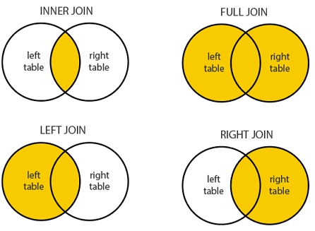

- DB Join이란?
    - 데이터베이스에서 2개 이상의 테이블을 연결하여 데이터를 검색하는 방법
        - 분산된 데이터의 효율적 검색 및 통합
    - 보통 **PK**혹은 **FK**로 두 테이블을 연결한다. (무조건은 아니다.)
    - JOIN을 위해선 적어도 하나의 칼럼은 서로 공유되고 있어야 한다.

- Join 종류들
    
    
    
    - **INNER JOIN**
        - 교집합
        - 기준 테이블과 JOIN 테이블의 중복된 값
    - **LEFT JOIN (LEFT OUTER JOIN)**
        - JOIN 기준 왼쪽 테이블의 모든 레코드가 SELECT되고, 오른쪽 테이블에서 일치하는 레코드를 반환
    - **RIGHT JOIN (RIGHT OUTER JOIN)**
        - JOIN 기준 오른쪽의 모든 레코드가 SELECT되고, 왼쪽 테이블에서 일치하는 레커드를 반환
    - **FULL JOIN (FULL OUTER JOIN)**
        - 양쪽 테이블의 모든 레코드 반환
        - 일치하지 않는 경우 NULL로 표시
    - **SELF JOIN**
        - 테이블이 자기 자신과 조인
        - 같은 테이블에 별칭을 두어 사용하여 두 개의 다른 테이블인 것처럼 취급
    

- 트랜잭션이란?
    - 데이터베이스의 상태를 변화시키기 위해 수행하는 작업의 단위
    - 개별적으로 수행되는 것이 아니라 묶어서 연산을 진행하고 싶은 경우에
    바로 **트랜잭션을** 사용
    
    **트랜잭션의 특징**
    
    1. 원자성(Atomicty): 전부 성공하거나, 전부 실패
        1. 트랜잭션이 DB에 모두 반영되던가, 아니면 전혀 반영되지 않아야 한다.
    2. 일관성(Consistency): 트랜잭션 전 후에 DB는 일관된 상태
        1. 트랜잭션의 작업 처리 결과가 항상 일관성이 있어야 한다.
        2. 항상 데이터가 우리가 원하는 정의에 일치해야 한다.
    3. 격리성(Isolation): 한 트랜잭션 수행 시, 다른 트랜잭션이 끼어들 수 없다
        1. 둘 이상의 트랜잭션이 동시에 실행되려고 할 때, 어떤 하나의 트랜잭션이라도 다른 트랜잭션의 연산에 끼어들 수 없다.
        2. 적절한 격리수준을 조절하는 것이 중요
    4. 지속성(Durablity): 성공한 트랜잭션은 영구적으로 반영
        1. 트랜잭션이 성공적으로 완료됐을 경우, 결과는 영구적으로 반영되어야 한다는 속성
    
    **COMMIT과 ROLLBACK**
    
    - COMMIT
        - 모든 작업을 정상적으로 처리하겠다고 확정하는 명령어
        - 변경된 모든 내용을 영구 저장
        - 하나의 트랜잭션 과정 종료
    - ROLLBACK
        - 트랜잭션 처리 과정에서 생긴 변경 사항을 취소
        - 트랜잭션 과정을 종료
        - 이전 COMMIT 위치로 복구
 
   
- Join on 과 where의 차이점
    
    **핵심 차이점**
    
    - **JOIN ON**: JOIN 전에 조건을 필터링
    - **WHERE:** JOIN 후에 조건을 필터링
    
    **공통점**
    
    - INNER JOIN 연산에는 큰 차이가 없다.
    
    **차이점**
    
    - OUTER JOIN시, ON으로 조건을 적용시켜야 OUTER TABLE에 NULL값이 포함된 행들이 반환된다.
    - WHERE을 사용했을 때 JOIN의 모든 조건이 끝나고 WHERE로 추가 조건을 걸어준다.