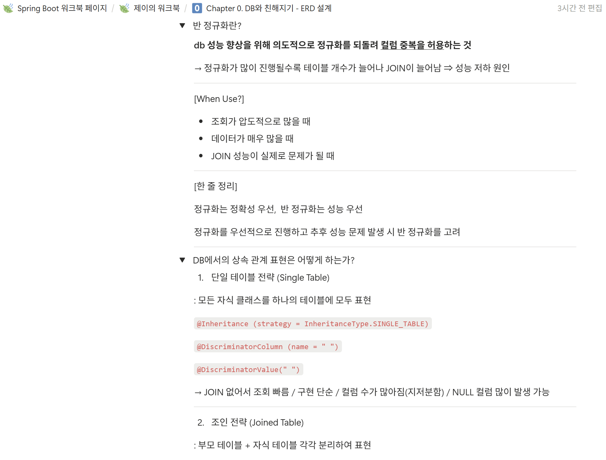

### 워크북 캡쳐

### 워크북 리뷰

<aside>
🌟

반정규화에서 [When Use?]로 언제 사용하는지, [한 줄 정리]로 정규화와 비교해서 자신만의 표현으로 정리한 점이 잘 작성되었다고 생각한다. 또한 상속관계 표현에서 각 전략별로 어노테이션과 특징을 한 눈에 정리한 것이 눈에 잘 들어왔다.

</aside>

### ERD 사진

### 설명

<aside>

**사용자 테이블**
회원 가입 페이지를 통하여 이름, 성별, 생년월일, 주소를 속성으로 뽑았고, 추후 활용을 위한 생성일시와 수정일시를 기록하도록 하였다. 또한 최초화면에서 소셜 로그인 기능을 지원하는 것으로 판단하여 소셜 로그인을 위한 속성들을 추가하였고, 화면에 따라 소셜 로그인 제공자는 `Enum` 타입으로 `KAKAO`, `NAVER`, `APPLE`, `GOOGLE`로 지정하였다. 지금은 간단한 구현을 위해 포인트를 사용자 테이블에서 저장하고 있으나, 추후 마이페이지 구현을 위해선 포인트 내역 테이블로 구분하는 것이 좋을 것이라고 생각한다. 

**약관 테이블**
사용자와 약관이 **N:M 관계**이기에 이를 해소하기 위한 조인 테이블(`terms_agrement`)을 하나 두었다. 또한 약관에는 필수와 선택으로 2가지 타입이 존재하기에 필수여부를 `Enum` 타입으로 관리하고자 하였다. 특히 약관의 경우 버전관리가 중요하기에 `terms_version` 속성을 추가하였다.

**음식 테이블**
사용자와 사용자가 회원 가입시 선택하게 되는 음식은 **N:M 관계**이기에 이를 해소하기 위한 조인 테이블(`preferred_food`)을 하나 두었다.

**문의 테이블**
문의 테이블의 경우 하나의 문의에 여러 사진을 첨부할 수 있다고 판단하여 별도의 문의 사진 테이블을 두었고, 또한 추후 관리자 관련 확장을 고려하여 문의 답변을 별도로 관리하는 테이블을 두었다.  어떤 관리자가 답변을 했는지 기록 등의 확장을 생각중이다.

**리뷰 테이블**
1명의 사용자가 여러 리뷰를 달 수 있으므로 **1:N 관계**로 구성하였다. 또한 하나의 리뷰에 여러 사진을 남길 수 있는 것으로 보아 (사진첨부 0/3) 별도의 리뷰 사진 테이블을 두었다.

**가게 테이블**
와이어프레임에서 필요로 한다고 판단되는 가게명, 가게유형, 영업시간, 주소 등을 속성으로 테이블을 구성하였다. 다른 사진 관련 테이블과 동일하게 하나의 가게가 여러 사진을 등록할 수 있는 것으로 보여 별도의 가게 사진 테이블을 두었다.

**미션 테이블**
사용자와 미션이 **N:M 관계**이기에 이를 해소하기 위한 조인테이블(`user_mission`) 테이블을 두었다. 와이어프레임을 통하여 미션 내용, 보상, 활성여부, 미션의 시작 일시와 종료일시 속성을 두었다. 미션 완료여부는 조인테이블에서 속성으로 관리하였다.

</aside>