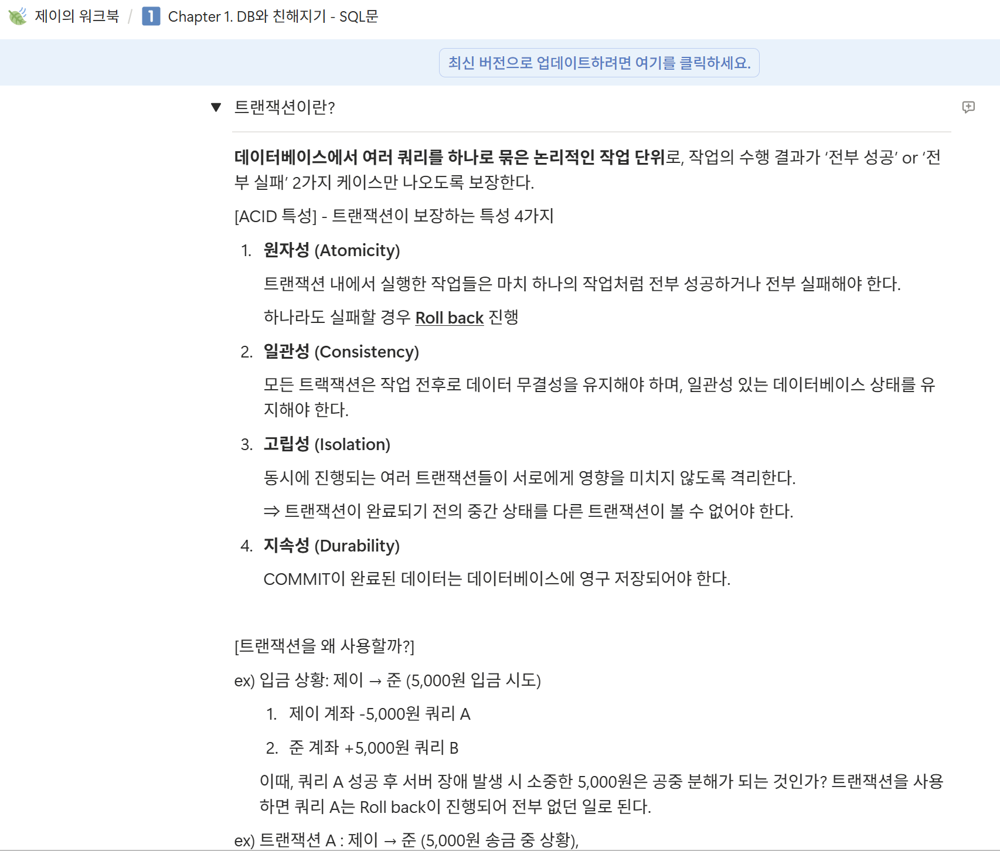
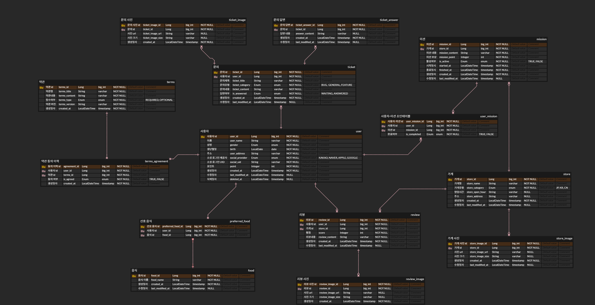

### 워크북 캡쳐



### 워크북 리뷰

<aside>

트랜잭션의 개념을 설명함에 있어, 단순히 개념을 나열하는 것이 아니라 두 사람 사이에 5,000원을 입금하는 상황을 예시로 들어 트랜잭션을 사용하는 이유부터 개념에 대한 이해를 돕고자 하는 것이 인상적이었다.

</aside>

### 설계한 DB 사진 (0주차 DB 수정 가능!)



### 본문
1) 리뷰 작성하는 쿼리, 사진의 경우는 일단 배제
```sql
INSERT INTO review (user_id, store_id, score, review_content, created_at, last_modified_at)
VALUES (1, 10, 5, '음 너무 맛있어요 포인트도 얻고 맛있는 맛집도 알게 된 것 같아 너무나도 행복한 식사였답니다. 다음에 또 올게요!!' NOW(), NOW());
```
2) 내가 진행중, 진행 완료한 미션 모아서 보는 쿼리(페이징 포함)
```sql
SELECT m.mission_title, m.mission_point, um.is_completed, um.created_at
FROM user_mission um
JOIN mission m ON um.mission_id = m.mission_id
WHERE um.user_id = 1
ORDER BY um.created_at DESC
LIMIT 10 OFFSET 0;
```
3) 마이 페이지 화면 쿼리
```sql
SELECT user_name, user_address, point
FROM user
WHERE user_id = 1;
```
4) 홈 화면 쿼리(현재 선택 된 지역에서 도전이 가능한 미션 목록, 페이징 포함)
```sql
SELECT s.store_name, m.mission_title, m.mission_point, m.finished_at
FROM mission m
JOIN store s ON m.store_id = s.store_id
WHERE s.store_address LIKE '%안암동%' AND m.is_active = 'TRUE' 
ORDER BY m.created_at DESC
LIMIT 15 OFFSET 0;
```

### 미션 기록
1) 리뷰 작성하는 쿼리, 사진의 경우는 일단 배제
<aside>

review 테이블에 사용자가 정한 평점과 리뷰 내용을 insert

생성일자와 수정일자 역시 현재 시각으로 저장해준다.

</aside>

2) 내가 진행중, 진행 완료한 미션 모아서 보는 쿼리(페이징 포함)
<aside>

user_mission 테이블과 mission 테이블을 조인하여 사용자의 미션 상태와 미션 title을 select

LIMIT으로 한 번에 보여줄 개수를 정하고, OFFSET으로 부하를 조절한다.

</aside>

3) 마이 페이지 화면 쿼리
<aside>

user_id로 사용자의 이름, 주소, 보유 포인트 등 마이 페이지에 들어갈 내용을 SELECT

</aside>

4) 홈 화면 쿼리(현재 선택 된 지역에서 도전이 가능한 미션 목록, 페이징 포함)
<aside>

store 테이블의 address 컬럼에서 “안암동”을 찾고, is_active가 TRUE인 미션을 SELECT

</aside>