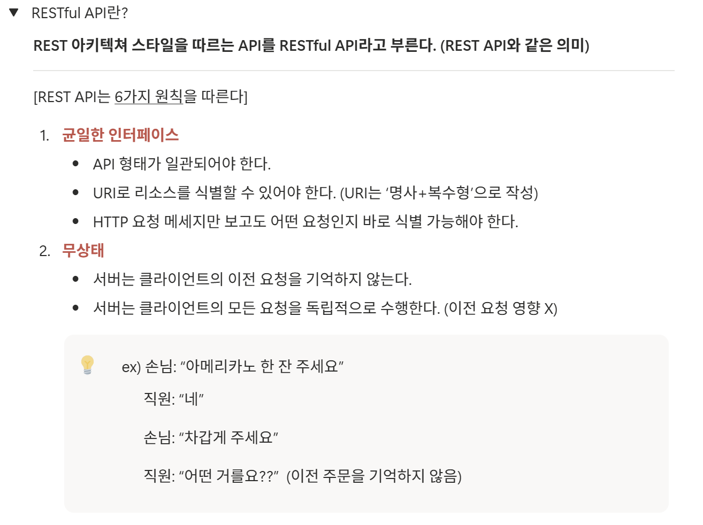

### 워크북 캡쳐



### 워크북 리뷰

<aside>
🌟

REST API의 특징으로 Stateless의 이전 요청에 대한 상태를 기억하지 않는다는 점을 예시를 통해 쉽게 받아들일 수 있도록 한 점이 인상적이었다.

</aside>

# 미션 기록
## 회원가입(POST: api/users/signup)

### Request Header

- `Content-Type: application/json`

### Path Variable

- 없음

### Query Param

- 없음

### Request Body

```json
{
	"userName": "nickname012",
	"gender": "MALE",
	"birth": "2001-09-13"
	"userAddress": "인천광역시 인하로 105번길 8"
}
```

### Response Body

```json
{
  "isSuccess": true,
  "code": "201",
  "message": "회원가입 되었습니다.",
  "result": {
    "userId": 1,
    "createdAt": "2026-03-26T20:49:00"
  }
}
```


## 홈 화면 조회(GET: api/users/me/home)
### Request Header

- `Authorization: Bearer {access_token}`

### Path Variable

- 없음

### Query Param

- `address`

### Request Body

```json

```

### Response Body

```json
{
  "isSuccess": true,
  "code": "200",
  "message": "홈 화면이 조회되었습니다.",
  "result": {
    "userRegion": "안암동",
    "userTotalPoint": 999999,
    "missionProgress": {
      "currentCompletedCount": 7,
      "totalTargetCount": 10
     },
    "missio": [  
      {
        "missionId": 101,
        "storeName": "반이학생마라탕",
        "storeCategory": "중식당",
        "d_day": 7,
        "missionContent": "10,000원 이상의 식사시",
        "missionPoint": 500,
      },
     {
        "missionId": 102,
        "storeName": "반이학생마라탕",
        "storeCategory": "중식당",
        "d_day": 7,
        "missionContent": "10,000원 이상의 식사시",
        "missionPoint": 500,
      }
    ]
  }
}
```


## 마이 페이지 리뷰 작성(POST: api/stores/{storeId}/review)
### Request Header

- `Content-Type: application/json`
- `Authorization: Bearer <access_token>`

### Path Variable

- `storeId`

### Query Param

- 없음

### Request Body

```json
{
  "score": 5,
  "content": "음 너무 맛있어요 포인트도 얻고 맛있는 맛집도 알게 된 것 같아 너무나도 행복한 식사였답니다. 다음에 또 올게요.",
  "reviewImageUrl": "url"
}
```

### Response Body

```json
{
 "isSuccess": true,
  "code": "201",
  "message": "리뷰가 작성되었습니다.",
  "result": {
  "reviewId": "501",
  "createdAt": "2026-03-26T21:30:00"
  }
}
```


## 미션 목록 조회(GET: api/missions)
### Request Header

- `Authorization: Bearer <access_token>`

### Path Variable

- 없음

### Query Param

- `status` (`CHALLENGING`, `COMPLETED`)

### Request Body

```json

```

### Response Body

```json
{
	 "isSuccess": true,
  "code": "200",
  "message": "미션 목록이 조회되었습니다.",
  "result": {
  "missions": [
    {
      "userMissionId": 1,
      "missionId": 10,
      "storeName": "가게이름a",
      "missionContent": "12,000원 이상의 식사를 하세요!",
      "isCompleted": "FALSE",
      "deadline": "2026-04-01T23:59:59"
    }
  ]
  }
}
```


## 미션 성공 누르기(PATCH: api/missions/{userMissionId}/complete)
### Request Header

- `Authorization: Bearer <access_token>`
- `Content-Type: application/json`

### Path Variable

- `userMissionId`

### Query Param

- 없음

### Request Body

```json

```

### Response Body

```json
{
	"isSuccess": true,
  "code": "200",
  "message": "미션 성공 요청을 보냈습니다.",
  "result": {
  "userMissionId": 201,
  "isCompleted": "TRUE",
  "earnedPoint": 500
  "currentTotalPoint": 1000
  }
}
```
