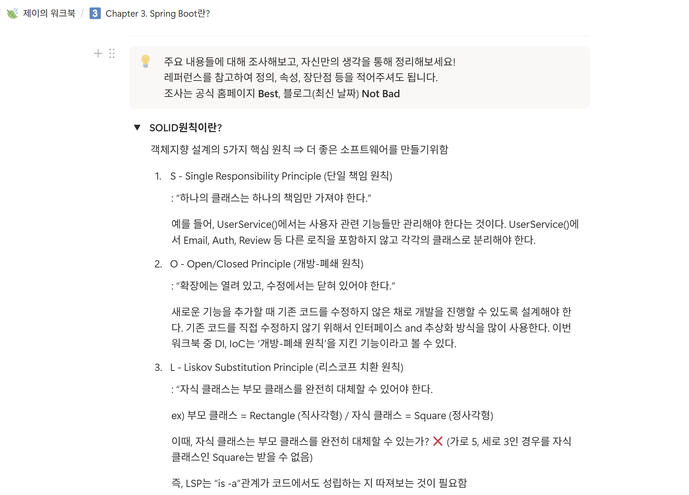

### 워크북 캡쳐

### 워크북 리뷰

<aside>
🌟

SOLID 원칙에 대한 개념적 설명 뿐만이 아니라, 각 원칙별 예시를 추가적으로 정리하여 해당 원칙에 대한 보다 쉬운 이해를 도우려고 하는 점이 인상적이다.

</aside>

# 미션 기록
**[스프링 MVC 요청/응답 흐름]**

1. DispatcherServlet: 입구 (Front Controller)
    1. 모든 HTTP 요청은 가장 먼저 DispatcherServlet이 받는다.
2. Handler Mapping: 길 찾기
    1. DispatcherServlet이 Handler Mapping에게 `/login` 과 같은 요청을 어디서 처리하는 지 `@Controller` 코드들을 뒤져서 알려준다.
3. Handler Adapter: 대리 실행
    1. 컨트롤러의 구현 방식이 각자마다 다를 수 있기에, Handler Adapter를 통해 컨트롤러의 매서드를 실제로 호출한다.
4. Controller: 비즈니스 로직 수행
    1. 파라미터를 읽고, 서비스를 호출해서 DB 데이터를 가져오고, 결과를 담아 다시 Adapter에게 돌려준다.
5. View Resolver: 화면 찾기 또는 데이터 변환
    1. HTML을 보여줄 때
        1. View Resolver가 “어떤 HTML 파일을 보여줄지 찾아서 화면을 렌더링한다.
    2. API(JSON)을 보낼 때
        1. `@ResponseBody`가 붙어있으면 HTML 대신 데이터를 JSON 형식으로 바로 변환
6. Response: 최종 응답
    1. 완성된 HTML이나 JSON 데이터가 DispatcherServlet을 거쳐 브라우저에게 전달된다.

**[요약 흐름도]**

- **Request** → (DispatcherServlet)
- **DispatcherServlet** → (Handler Mapping) : "어디로 갈까?"
- **DispatcherServlet** → (Handler Adapter) : "이 컨트롤러 실행해줘"
- **Controller** : "로직 처리 완료!"
- **DispatcherServlet** → (View Resolver) : "어떤 화면 보여줄까?" (API의 경우 생략)
- **Response** → 브라우저 완료
